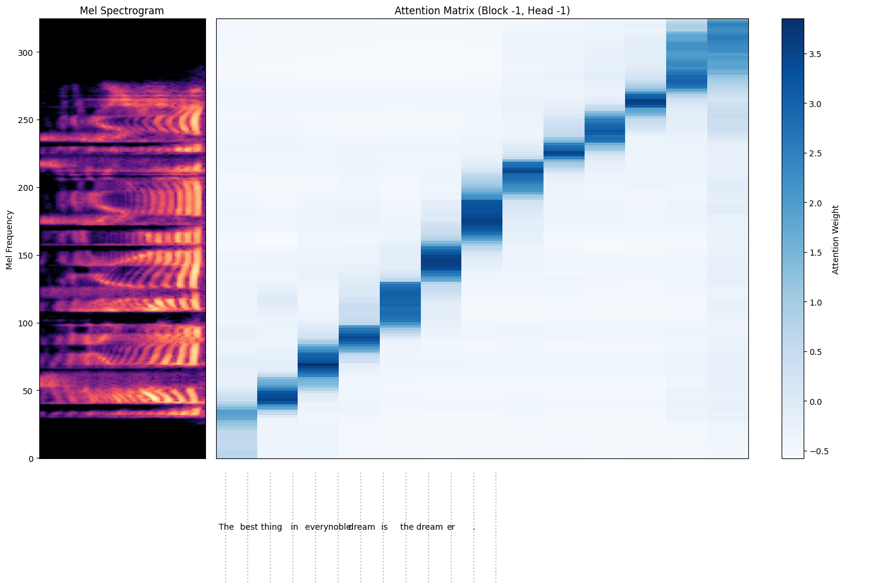
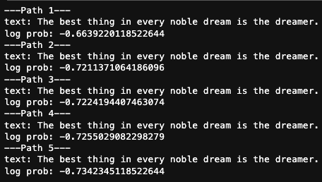

# whisper-research
Extending whisper functionalities for research purposes. 
Code is built on top of Openai whisper.

## Alignment visualization
Extract text and audio alignment from the decoder.

## N candidates prediction
Return N best candidates' transcriptions in a list.

## How to use
Please refer to tests.ipynb for examples.

## Reference
Official whisper implementation [link](https://github.com/openai/whisper/tree/main)
Interpreting OpenAI's Whisper blog [link](https://er537.github.io/blog/2023/09/05/whisper_interpretability.html#section1.1)
